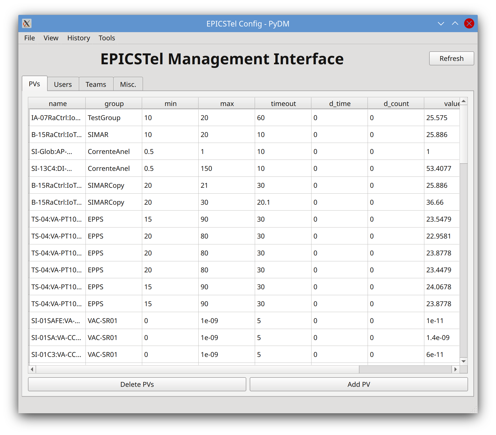

# EPICSTEL

Python Telegram bot that monitors, plots, gets PVs and much more

## Shortcuts

- [Documentation](https://cnpemcamp.sharepoint.com/sites/iot/SitePages/EPICSTel.aspx)
- [Changelog](CHANGELOG.md)
- [Running integration tests](tests/README.md)
- [Management UI](https://github.com/lnls-sirius/pydm-opi)

## Installation

You may either deploy a Docker container with the composefile in [Docker](https://gitlab.cnpem.br/IoT/epicstel/tree/master/docker) or run it directly. If you desire the latter, just follow install the Python requirements (`pip install -r requirements.txt`) and run the bot with Python >3.6, utilizing the following CLI arguments:

`python3 main.py TELEGRAM_TOKEN ARCHIVER_DB_USERNAME ARCHIVER_DB_PASSWORD MONGODB_USERNAME MONGODB_PASSWORD`

## DB Management UI

To access the UI, please check out [this project](https://github.com/lnls-sirius/pydm-opi).

## Legacy versions 

Legacy versions are available in their respective branches (0.1.0, 1.0.0, 2.0.1, 3.0.1))
